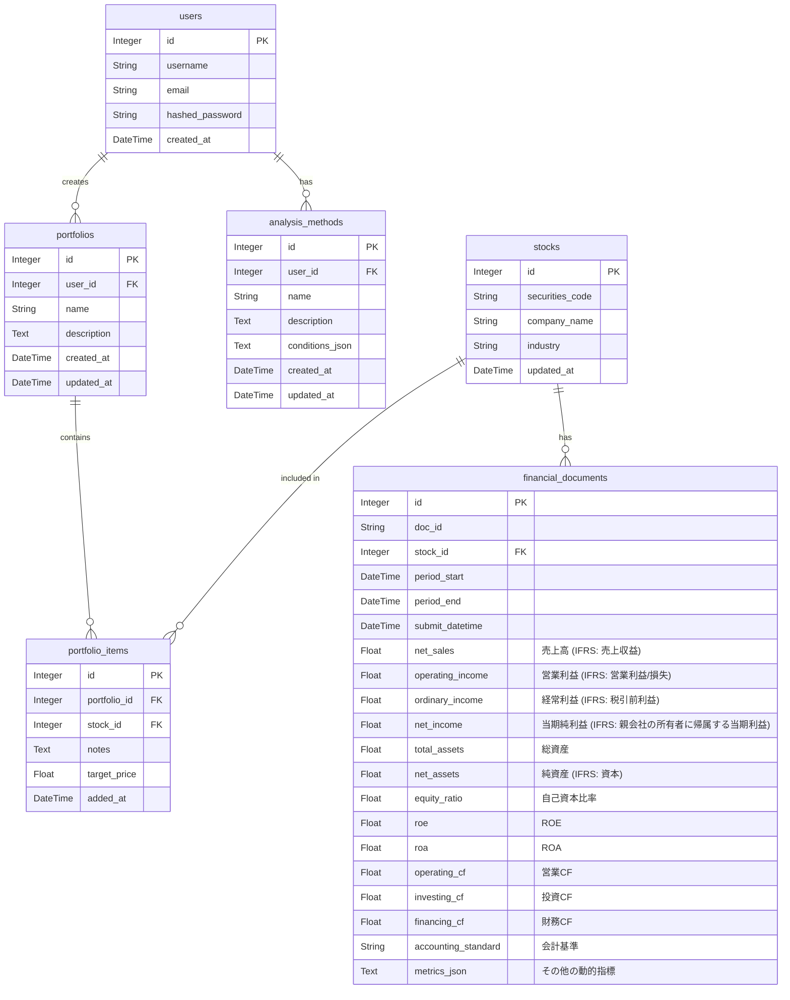

# Database Schema ER Diagram

This diagram represents the current database models defined in `backend/models.py`.

```mermaid
erDiagram
    users {
        Integer id PK
        String username
        String email
        String hashed_password
        DateTime created_at
    }

    stocks {
        Integer id PK
        String securities_code
        String company_name
        String industry
        DateTime updated_at
    }

    financial_documents {
        Integer id PK
        String doc_id
        Integer stock_id FK
        DateTime period_start
        DateTime period_end
        DateTime submit_datetime
        Float net_sales "売上高 (IFRS: 売上収益)"
        Float operating_income "営業利益 (IFRS: 営業利益/損失)"
        Float ordinary_income "経常利益 (IFRS: 税引前利益)"
        Float net_income "当期純利益 (IFRS: 親会社の所有者に帰属する当期利益)"
        Float total_assets "総資産"
        Float net_assets "純資産 (IFRS: 資本)"
        Float equity_ratio "自己資本比率"
        Float roe "ROE"
        Float roa "ROA"
        Float operating_cf "営業CF"
        Float investing_cf "投資CF"
        Float financing_cf "財務CF"
        String accounting_standard "会計基準"
        Text metrics_json "その他の動的指標"
    }

    analysis_methods {
        Integer id PK
        Integer user_id FK
        String name
        Text description
        Text conditions_json
        DateTime created_at
        DateTime updated_at
    }

    portfolios {
        Integer id PK
        Integer user_id FK
        String name
        Text description
        DateTime created_at
        DateTime updated_at
    }

    portfolio_items {
        Integer id PK
        Integer portfolio_id FK
        Integer stock_id FK
        Text notes
        Float target_price
        DateTime added_at
    }

    users ||--o{ analysis_methods : "has"
    users ||--o{ portfolios : "creates"
    stocks ||--o{ financial_documents : "has"
    portfolios ||--o{ portfolio_items : "contains"
    stocks ||--o{ portfolio_items : "included in"
```
