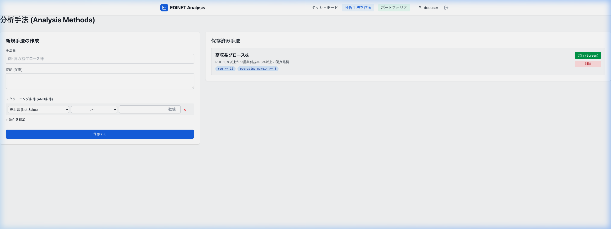

# [SCR003] 分析手法

ユーザー独自のスクリーニング条件（分析手法）を作成・管理し、実行結果を確認します。

## 変更履歴

| No | 変更日 | 変更セクション | 変更項目 | 変更者 |
| :--- | :--- | :--- | :--- | :--- |
| 1 | 2026-03-07 | 全体 | 新規作成 | yuji |
| 2 | 2026-03-11 | 指標 | 利用可能な指標を15種類に更新 | yuji |
| 3 | 2026-03-25 | 成長性分析 | YoY成長率をスクリーニング条件に追加 | antigravity |

## 画面イメージ

## 役割
ユーザー独自のスクリーニング条件 (分析手法) を作成・管理し、実行結果を確認する。

## 画面入出力項目

### 左カラム：新規手法の作成フォーム

| No | 項目名 | イベント | フォームの種類 | 必須 | 桁数 | 制約 | 備考 |
| :--- | :--- | :--- | :--- | :--- | :--- | :--- | :--- |
| 1 | 手法名 | - | テキスト | ○ | 最大：50 | - | \&nbsp; |
| 2 | 説明 | - | テキストエリア | - | 最大：200 | - | \&nbsp; |
| 3 | 指標選択 | - | セレクトボックス | ○ | - | - | 23種類から選択（詳細は下記参照） |
| 4 | 演算子選択 | - | セレクトボックス | ○ | - | - | >=, <=, == 等 |
| 5 | 閾値入力 | - | テキスト | ○ | - | 形式：数値 | \&nbsp; |
| 6 | 条件追加ボタン | ○ | ボタン（画像ボタン含む） | - | - | - | 条件行を追加 |
| 7 | 保存ボタン | ○ | ボタン（画像ボタン含む） | - | - | - | 手法をDBへ保存 |

#### 選択可能な指標一覧（17種類）
1.  **売上高** (Net Sales)
2.  **営業利益** (Operating Income)
3.  **経常利益** (Ordinary Income)
4.  **当期純利益** (Net Income)
5.  **資産合計** (Total Assets)
6.  **純資産合計** (Total Net Assets)
7.  **自己資本比率** (Equity Ratio)
8.  **1株当たり純利益** (EPS)
9.  **1株当たり純資産** (BPS)
10. **ROE** (自己資本利益率)
11. **ROA** (総資産利益率)
12. **営業利益率** (Operating Margin)
13. **PER** (株価収益率)
14. **PBR** (純資産倍率)
15. **配当利回り** (Dividend Yield)
16. **売上高成長率 [YoY]** (Sales Growth)
17. **営業利益成長率 [YoY]** (Operating Income Growth)
18. **経常利益成長率 [YoY]** (Ordinary Income Growth)
19. **当期純利益成長率 [YoY]** (Net Income Growth)
20. **配当成長率 [YoY]** (Dividend Growth)
21. **営業CF成長率 [YoY]** (Operating CF Growth)
22. **フリーキャッシュフロー (FCF)** (Operating CF + Investing CF)
23. **FCF成長率 [YoY]** (FCF Growth)

### 右カラム：保存済み手法リスト・実行結果

| No | 項目名 | イベント | フォームの種類 | 必須 | 桁数 | 制約 | 備考 |
| :--- | :--- | :--- | :--- | :--- | :--- | :--- | :--- |
| 8 | 手法カード：手法名 | - | データ表示 | - | - | - | \&nbsp; |
| 9 | 手法カード：実行ボタン | ○ | ボタン（画像ボタン含む） | - | - | - | 検索APIをコール |
| 10 | 手法カード：削除ボタン | ○ | ボタン（画像ボタン含む） | - | - | - | 削除APIをコール |
| 11 | 検索結果テーブル | - | データ表示 | - | - | - | 条件合致銘柄を表示 |

## イベント処理概要

### No.0 初期表示

**処理**
1. 保存済み手法リストを取得する
   - バックエンド「手法一覧取得API」をコールする
   →画面表示：手法カード一覧に反映（処理終了）

### No.7 保存ボタン押下

**INPUT**

| 項目名 | 備考 |
| :--- | :--- |
| 手法名 | 項目No.1の値 |
| 説明 | 項目No.2の値 |
| スクリーニング条件 | 項目No.3〜5のリスト |

**処理**
1. 分析手法を保存する
   - バックエンド「手法作成API」をコールする
     リクエストパラメータ
     　name = 手法名
     　description = 説明
     　filters = 条件リスト
   →画面表示：保存完了メッセージを表示、手法リストを更新（処理終了）

### No.9 実行ボタン押下

**INPUT**

| 項目名 | 備考 |
| :--- | :--- |
| 手法ID | 選択した手法のID |

**処理**
1. スクリーニングを実行する
   - バックエンド「スクリーニング実行API」をコールする
     リクエストパラメータ
     　method_id = 手法ID
   →画面表示：検索結果テーブルに合致銘柄を表示（処理終了）
