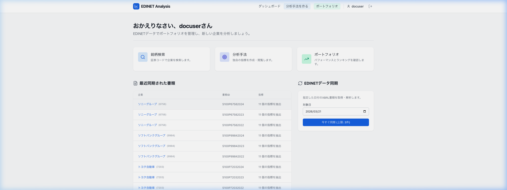

# Dashboard

おかえりなさい、投資家さん。EDINETデータでポートフォリオを管理し、新しい企業を分析しましょう。

## 画面イメージ

## 役割
ログイン直後に表示されるホーム画面。主要機能へのショートカットと、最近のデータ更新状況を提供する。

## 主要要素
*   **ヘッダーメッセージ**: 「おかえりなさい、〇〇さん」
*   **クイックアクセスカード** (3列グリッド):
    1. 銘柄検索 (アイコンと説明)
    2. 分析手法 (アイコンと説明)
    3. ポートフォリオ (アイコンと説明)
*   **最近同期された書類**:
    *   表形式: `企業 (証券コードとリンク)`, `書類ID`, `抽出された指標数`を表示
    *   データが空の場合はプレースホルダーを表示
*   **EDINETデータ同期フォーム**:
    *   対象日入力 (`input type="date"`)
    *   「今すぐ同期」ボタン
    *   処理結果メッセージ (成功 / エラー) 表示領域
