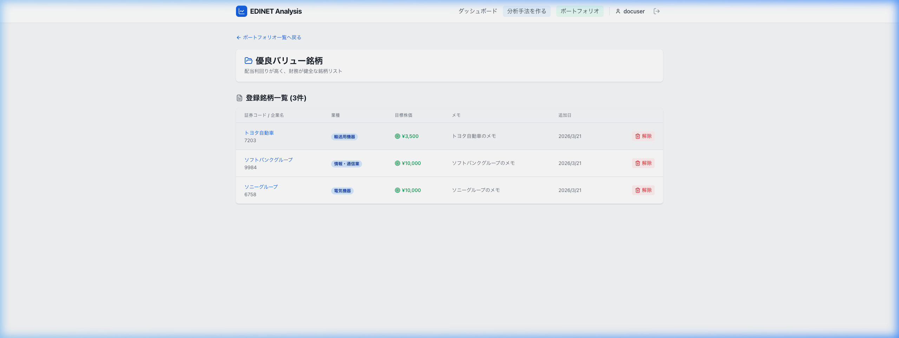

# Portfolio Detail

選択したポートフォリオに含まれる具体的な銘柄(Portfolio Items)を一覧表示・管理します。

## 画面イメージ

## 役割
選択したポートフォリオに含まれる具体的な銘柄(Portfolio Items)を一覧表示・管理する。

## 主要要素
*   「ポートフォリオ一覧へ戻る」リンク
*   **ヘッダー**: ポートフォリオ名、説明
*   **登録銘柄一覧表**:
    *   カラム: `証券コード / 企業名`, `業種`, `目標株価`, `メモ`, `追加日`, `操作 (解除ボタン)`
    *   企業名からは銘柄詳細画面 (`/stocks/:code`) へのリンク

## モーダル
*   **解除確認モーダル (DeleteModal)**: 特定の銘柄をポートフォリオから外す前の確認。
