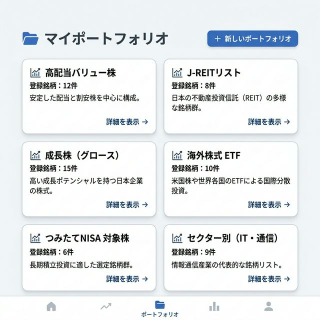

# [SCR004] ポートフォリオ一覧

ユーザーが作成したポートフォリオのグループを管理します。

## 変更履歴

| No | 変更日 | 変更セクション | 変更項目 | 変更者 |
| :--- | :--- | :--- | :--- | :--- |
| 1 | 2026-03-07 | 全体 | 新規作成 | yuji |

## 画面イメージ

## 役割
ユーザーが作成したポートフォリオのグループを管理する。

## 画面入出力項目

| No | 項目名 | イベント | フォームの種類 | 必須 | 桁数 | 制約 | 備考 |
| :--- | :--- | :--- | :--- | :--- | :--- | :--- | :--- |
| 1 | 戻るリンク | - | リンク表示 | - | - | - | ダッシュボードへ戻る |
| 2 | 新しいポートフォリオ作成ボタン | ○ | ボタン（画像ボタン含む） | - | - | - | 作成フォームを展開 |
| 3 | ポートフォリオ名 | - | テキスト | ○ | 最大：50 | - | \&nbsp; |
| 4 | 説明 | - | テキストエリア | - | 最大：200 | - | \&nbsp; |
| 5 | 作成ボタン | ○ | ボタン（画像ボタン含む） | - | - | - | DBに登録 |
| 6 | 手法カード：タイトル | - | リンク表示 | - | - | - | 銘柄詳細画面へ遷移 |
| 7 | 手法カード：削除ボタン | ○ | ボタン（画像ボタン含む） | - | - | - | 削除モーダルを表示 |

## イベント処理概要

### No.0 初期表示

**処理**
1. ユーザーのポートフォリオ一覧を取得する
   - バックエンド「ポートフォリオ一覧取得API」をコールする
   →画面表示：ポートフォリオカード一覧に反映（処理終了）

### No.5 作成ボタン押下

**INPUT**

| 項目名 | 備考 |
| :--- | :--- |
| ポートフォリオ名 | 項目No.3の値 |
| 説明 | 項目No.4の値 |

**処理**
1. 新規ポートフォリオを作成する
   - バックエンド「ポートフォリオ作成API」をコールする
     リクエストパラメータ
     　name = ポートフォリオ名
     　description = 説明
   →画面表示：作成フォームを閉じ、一覧を更新（処理終了）

### No.7 削除ボタン押下

**INPUT**

| 項目名 | 備考 |
| :--- | :--- |
| ポートフォリオID | 選択した項目のID |

**処理**
1. ポートフォリオを削除する
   - バックエンド「ポートフォリオ削除API」をコールする
     リクエストパラメータ
     　portfolio_id = ポートフォリオID
   →画面表示：削除確認モーダルを閉じ、一覧を更新（処理終了）
