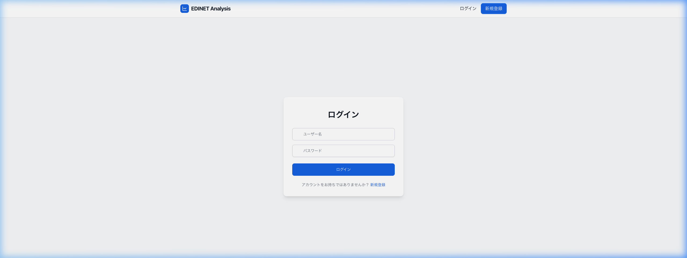

# [SCR007] 新規登録

新しいユーザーをシステムに登録するための画面です。

## 変更履歴

| No | 変更日 | 変更セクション | 変更項目 | 変更者 |
| :--- | :--- | :--- | :--- | :--- |
| 1 | 2026-03-07 | 全体 | 新規作成 | yuji |

## 画面イメージ

## 役割
新規ユーザーの登録。

## 画面入出力項目

| No | 項目名 | イベント | フォームの種類 | 必須 | 桁数 | 制約 | 備考 |
| :--- | :--- | :--- | :--- | :--- | :--- | :--- | :--- |
| 1 | ユーザー名 | - | テキスト | ○ | 最大：50 | - | \&nbsp; |
| 2 | メールアドレス | - | メールアドレス | ○ | - | 形式：メールアドレス | \&nbsp; |
| 3 | パスワード | - | パスワード | ○ | - | - | \&nbsp; |
| 4 | 登録ボタン | ○ | ボタン（画像ボタン含む） | - | - | - | 登録APIをコール |
| 5 | ログイン画面へのリンク | - | リンク表示 | - | - | - | \&nbsp; |

## イベント処理概要

### No.4 登録ボタン押下

**INPUT**

| 項目名 | 備考 |
| :--- | :--- |
| ユーザー名 | 項目No.1の値 |
| メールアドレス | 項目No.2の値 |
| パスワード | 項目No.3の値 |

**処理**
1. 新規ユーザーを登録する
   - バックエンド「ユーザー作成API」をコールする
     リクエストパラメータ
     　username = ユーザー名
     　email = メールアドレス
     　password = パスワード
   →画面表示：登録成功時、ログイン画面へ遷移。失敗時、エラーメッセージを表示（処理終了）
