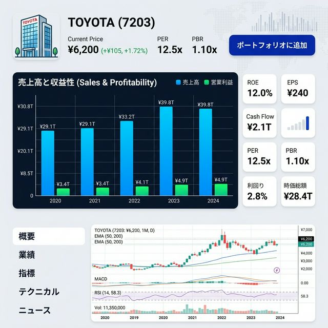

# [SCR002] 銘柄詳細

特定の企業（銘柄）の詳細なハイライトと財務データを視覚的に表示します。

## 変更履歴

| No | 変更日 | 変更セクション | 変更項目 | 変更者 |
| :--- | :--- | :--- | :--- | :--- |
| 1 | 2026-03-07 | 全体 | 新規作成 | yuji |
| 2 | 2026-03-11 | 指標 | EPS/BPS/ROE/ROA等を追加 | yuji |
| 3 | 2026-03-25 | 成長性分析 | 成長率グラフ、CAGR、業績予想を追加 | antigravity |

## 画面イメージ

## 役割
特定の企業（銘柄）の詳細なハイライトと財務データを視覚的に表示する。

## 画面入出力項目

| No | 項目名 | イベント | フォームの種類 | 必須 | 桁数 | 制約 | 備考 |
| :--- | :--- | :--- | :--- | :--- | :--- | :--- | :--- |
| 1 | 戻るリンク | - | リンク表示 | - | - | - | ダッシュボードへ戻る |
| 2 | 企業名ラベル | - | データ表示 | - | - | - | \&nbsp; |
| 3 | 証券コードラベル | - | データ表示 | - | - | - | 4桁 |
| 4 | 現在株価 | - | データ表示 | - | - | - | リアルタイム株価 |
| 5 | PER | - | データ表示 | - | - | - | 株価 / EPS |
| 6 | PBR | - | データ表示 | - | - | - | 株価 / BPS |
| 7 | 売上高・利益グラフ | - | 画像表示 | - | - | - | BarChart表示 |
| 8 | 指標グリッド：EPS | - | データ表示 | - | - | - | 1株当たり純利益 |
| 9 | 指標グリッド：BPS | - | データ表示 | - | - | - | 1株当たり純資産 |
| 10 | 指標グリッド：ROE | - | データ表示 | - | - | - | 自己資本利益率 |
| 11 | 指標グリッド：ROA | - | データ表示 | - | - | - | 総資産利益率 |
| 12 | 指標グリッド：自己資本比率 | - | データ表示 | - | - | - | \&nbsp; |
| 13 | 成長率グラフ | - | 画像表示 | - | - | - | 売上高・利益のYoY推移（折れ線グラフ） |
| 14 | CAGR（売上高） | - | データ表示 | - | - | - | 年平均成長率 |
| 15 | CAGR（営業利益） | - | データ表示 | - | - | - | \&nbsp; |
| 16 | 業績予想（今期） | - | データ表示 | - | - | - | 今期の会社予想値 |
| 17 | ポートフォリオに追加ボタン | ○ | ボタン（画像ボタン含む） | - | - | - | 登録用モーダルを表示 |

### モーダル：ポートフォリオ追加

| No | 項目名 | イベント | フォームの種類 | 必須 | 桁数 | 制約 | 備考 |
| :--- | :--- | :--- | :--- | :--- | :--- | :--- | :--- |
| 14 | 対象ポートフォリオ | - | セレクトボックス | ○ | - | - | 既存リストから選択 |
| 15 | 目標株価 | - | テキスト | - | 最大：10 | 形式：数値 | 任意入力 |
| 16 | メモ | - | テキストエリア | - | 最大：200 | - | 任意入力 |
| 17 | 保存ボタン | ○ | ボタン（画像ボタン含む） | - | - | - | 登録APIをコール |

## イベント処理概要

### No.0 初期表示

**INPUT**

| 項目名 | 備考 |
| :--- | :--- |
| 証券コード | URLパラメータから取得 |

**処理**
1. 銘柄詳細情報を取得する
   - バックエンド「銘柄詳細取得API」をコールする
2. 成長性分析データを取得する
   - バックエンド「成長性分析データ取得API」をコールする
   →画面表示：企業名、株価、各種指標、成長率グラフ、CAGRを反映（処理終了）

### No.17 ポートフォリオに追加ボタン押下

**処理**
1. 入力用モーダルを表示する
   →画面表示：ポートフォリオ追加モーダルを表示（処理終了）

### No.21 モーダル保存ボタン押下

**INPUT**

| 項目名 | 備考 |
| :--- | :--- |
| ポートフォリオID | 項目No.14の値 |
| 目標株価 | 項目No.15の値 |
| メモ | 項目No.16の値 |

**処理**
1. ポートフォリオに追加する
   - バックエンド「ポートフォリオ銘柄追加API」をコールする
     リクエストパラメータ
     　portfolio_id = ポートフォリオID
     　stock_code = 現在表示中の証券コード
     　target_price = 目標株価
     　memo = メモ
   →画面表示：モーダルを閉じ、完了通知を表示（処理終了）
